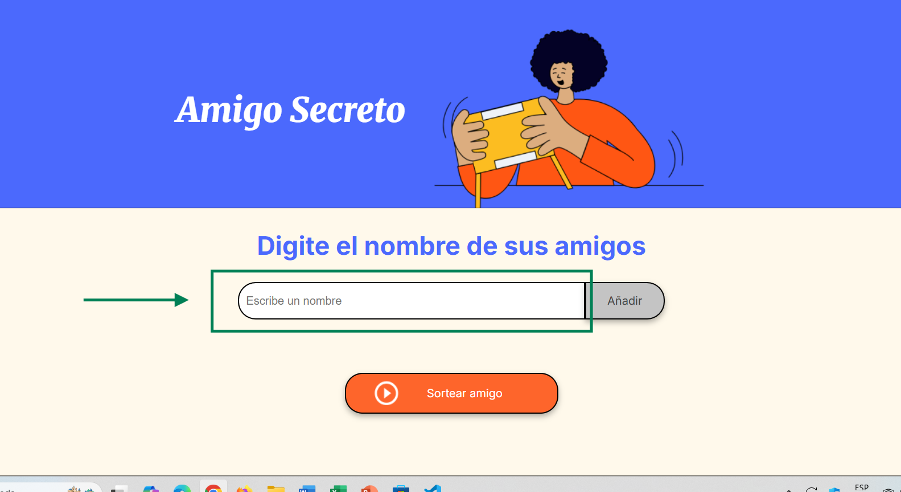
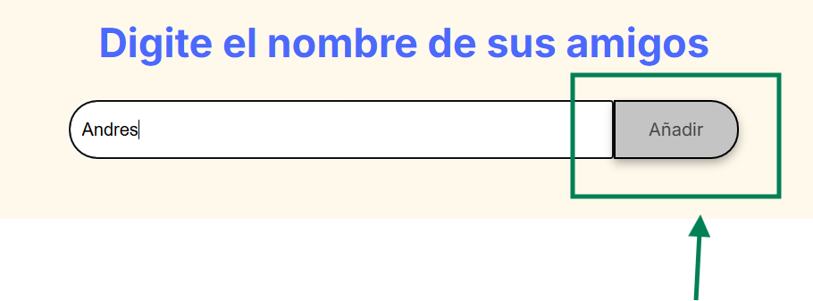
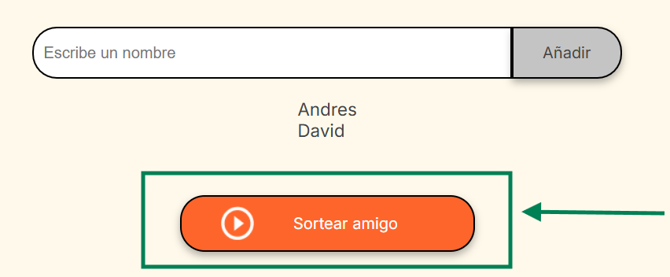

# desafioAmigoSecreto

Descripción de su proyecto;

Este proyecto consiste en una forma de jugar al amigo secreto, ingresando los valores de los nombres y seleccionando aleatoriamente uno de esos nombres, mostrándolo en pantalla.

Funcionalidades

- Ingreso de nombres
- Validación de campos vacíos
- Generación de la lista de nombres en pantalla
- Selección aleatoria de uno de los nombres de la lista.

Cómo usar la aplicación?

Solo es necesario ingresar nombres en el campo respectivo: 

Posteriormente presionar el botón de Agregar:

Continuar asi hasta tener los nombres suficientes, y por último se selecciona el botón de Sortear Amigo para generar el nombre aleatorio.

Y se obtiene el nombre aleatorio:

Autores del proyecto.

Jhonathan Zapata
